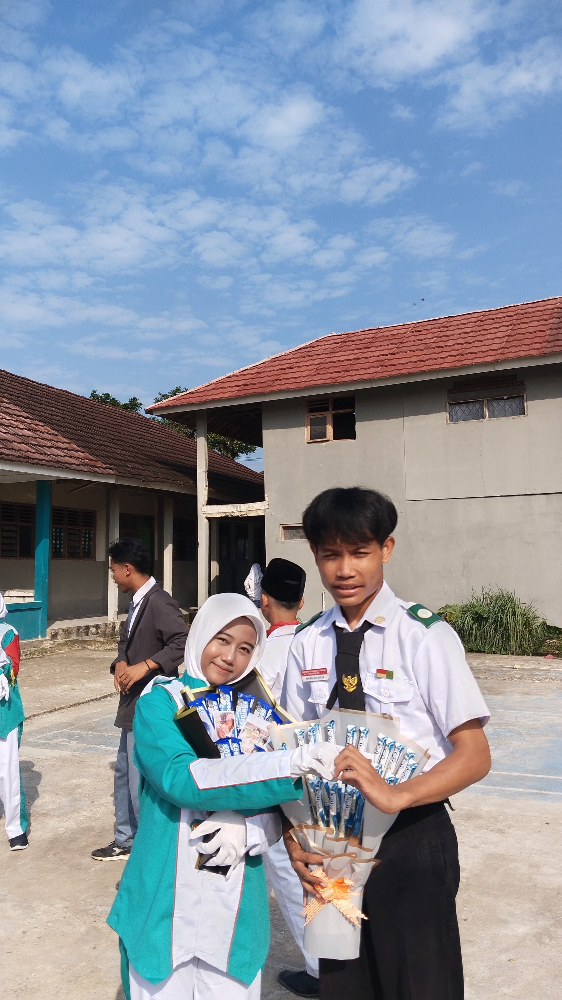
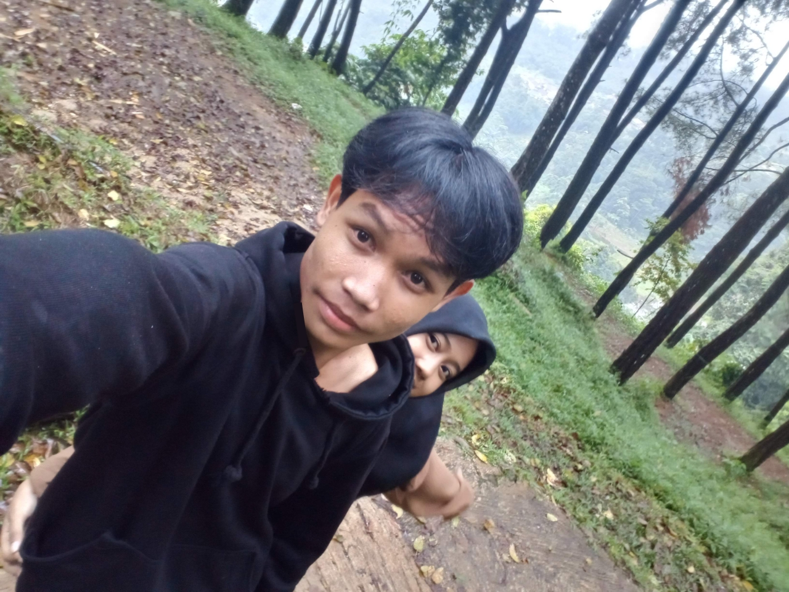

<html lang="id">
<head>
  <meta charset="UTF-8" />
  <meta name="viewport" content="width=device-width, initial-scale=1.0" />
  <title>Kenangan Lucu Bareng Pacar</title>
  <link href="https://fonts.googleapis.com/css2?family=Comic+Neue&display=swap" rel="stylesheet">
  
</head>
<body>
  

    

      Udah dapet izin dari yang punya foto ini belum?
      

        <button class="button" onclick="checkGate(1, true)">Udah dong</button>
        <button class="button" onclick="checkGate(1, false)">Belum sih</button>
      

    

    

      Kamu mantannya dia ya?
      

        <button class="button" onclick="checkGate(2, true)">Iya hehe</button>
        <button class="button" onclick="checkGate(2, false)">Bukan kok</button>
      

    

    

      Wih, kepo amat sih?
      

        <button class="button" onclick="checkGate(3, true)">Iyalah wkwk</button>
        <button class="button" onclick="checkGate(3, false)">Enggak juga sih</button>
      

    

  

  

  

    <h2 class="text-box">Yaaa ampun kepo banget si kalian wkwk!</h2>
    
Tanggal Jadian: 29 September 2023

    
Target Nikah (Aamiin!): 29 September 2032

    

      

        
        
10 April 2025 - Main ke pantai

      

      

        
        
20 November 2025 - Cosplay bareng

      

      

        
        
5 Maret 2024 - Jalan ke gunung

      

    

    

      <a href="https://wa.me/6283877486039?text=Wah%20semoga%20langgeng%20yaaa" target="_blank" class="wa-button">
        Kirim Ucapan via WhatsApp
      </a>
    

  

  
</body>
